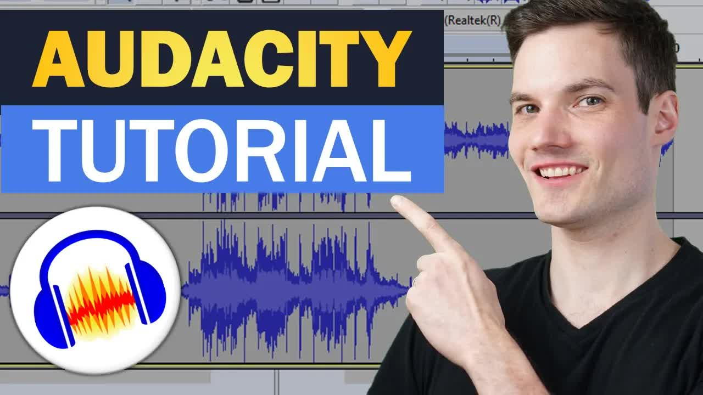

# 🔊-How-to-use-Audacity-to-Record-&-Edit-Audio-｜-Beginners-Tutorial

> 🆓 **نسخه رایگان** - کیفیت 360p
> برای کیفیت بالاتر، MP3، زیرنویس و رمزگذاری به [workflow شماره 01](../../actions) بروید

  <picture>
    
  </picture>

---

## Video Information

| Property | Value |
|----------|-------|
| **Video Name** | `🔊-How-to-use-Audacity-to-Record-&-Edit-Audio-｜-Beginners-Tutorial` |
| **Original Link** | [YouTube Video](https://www.youtube.com/watch?v=yzJ2VyYkmaA) |
| **Total Size** | **2 parts** - **47.08 MB** |
| **Quality** | **360p (Free)** |

---

## Download Links

> ⬇️ Download **all parts**, then open `🔊-How-to-use-Audacity-to-Record-&-Edit-Audio-｜-Beginners-Tutorial.zip`

| # | File | Link |
|---|------|------|
| 1 | `🔊-How-to-use-Audacity-to-Record-&-Edit-Audio-｜-Beginners-Tutorial.z01` | [Download](https://raw.githubusercontent.com/KhodAmoozMedia/Ourtube/main/videos/%F0%9F%94%8A-How-to-use-Audacity-to-Record-%26-Edit-Audio-%EF%BD%9C-Beginners-Tutorial/%F0%9F%94%8A-How-to-use-Audacity-to-Record-%26-Edit-Audio-%EF%BD%9C-Beginners-Tutorial.z01) |
| 2 | `🔊-How-to-use-Audacity-to-Record-&-Edit-Audio-｜-Beginners-Tutorial.zip` | [Download](https://raw.githubusercontent.com/KhodAmoozMedia/Ourtube/main/videos/%F0%9F%94%8A-How-to-use-Audacity-to-Record-%26-Edit-Audio-%EF%BD%9C-Beginners-Tutorial/%F0%9F%94%8A-How-to-use-Audacity-to-Record-%26-Edit-Audio-%EF%BD%9C-Beginners-Tutorial.zip) |

---

*🆓 Free Version - [avasam.ir](https://avasam.ir)*
